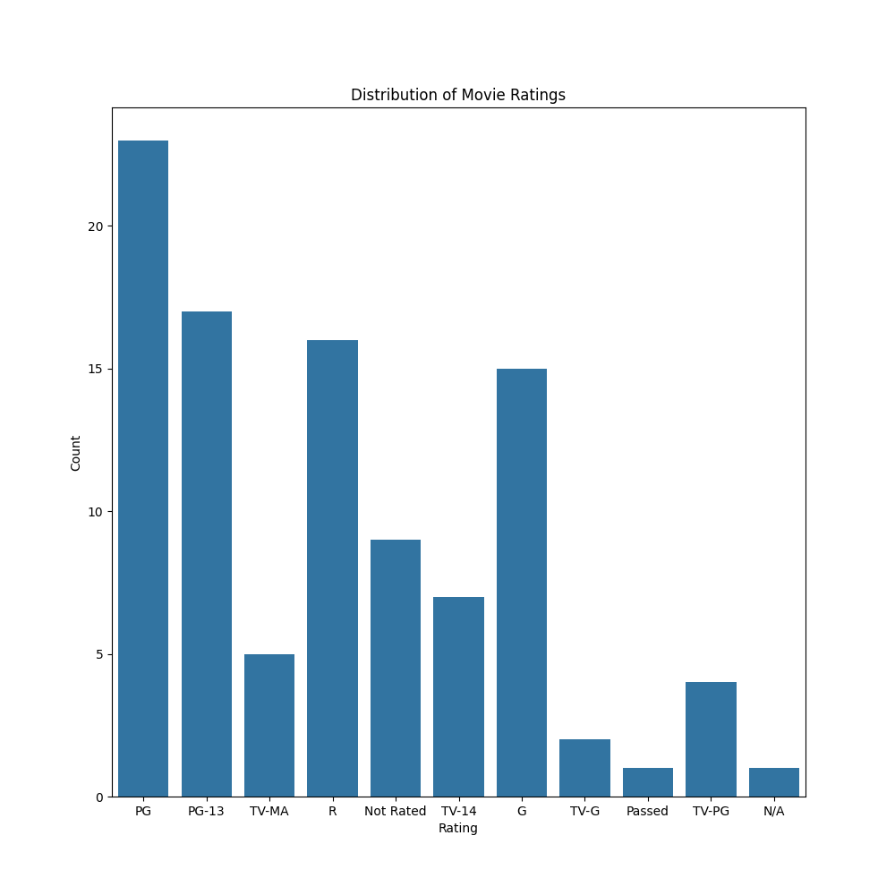
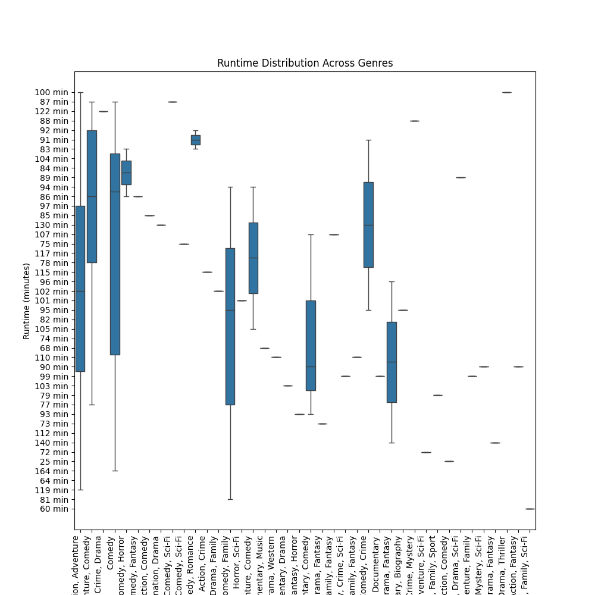
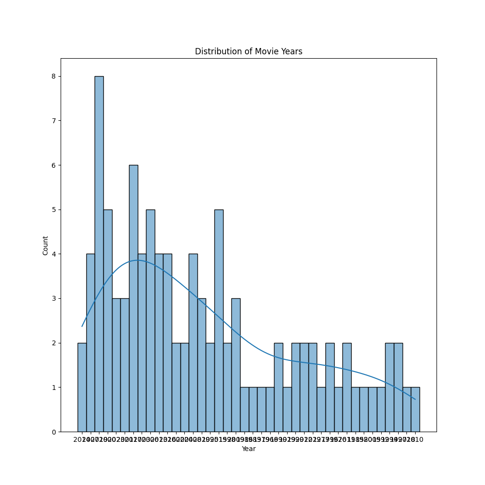

# Project2

## Task - 1: 

Sitemap Parser:

This program parses the sitemap files from a given website to extract all the URLs and their date of creation (if available).

Website: The base website used for this demo is CNN (https://cnn.com). CNN has a large sitemap index with multiple sitemap files containing thousands of URLs from their site.

Approach:

The SitemapParser class takes the base URL of a website in the constructor. It first retrieves all the sitemap URLs listed in the robots.txt file. Then, it iterates through each sitemap, downloads the XML content, and extracts the <loc> and <lastmod> elements to get the URL and date of creation. This data is stored in a Pandas DataFrame and exported to a CSV file named after the sitemap.

Finally, the list of DataFrames is returned containing URLs and dates extracted from all sitemaps.

## Task - 2:

Reddit API Fetcher: This program fetches post data from a specified subreddit using the Reddit API.

Overview: The RedditAPIFetcher class handles making the API request and converting the JSON response into a Pandas DataFrame.

Key features:

1. Specify subreddit and number of posts to retrieve
2. Makes API request to retrieve posts
3. Extracts post data into a dictionary
4. Stores post data in a Pandas DataFrame
5. Returns the DataFrame and saves to a CSV file

##Task - 3:
Here is a draft README for the movie data scraper:

# Movie Data Scraper

This program scrapes movie data from the IMDb API and analyzes it.

## Overview

The `MovieDataScraper` class handles:

- Querying the API to get movie IDs and details
- Scraping data for multiple movies into a Pandas DataFrame
- Saving the DataFrame to a CSV
- Generating plots for analysis

## Methodology

- The IMDb API is used to search for movie IDs and fetch details 
- Movie IDs are retrieved in batches using pagination
- Details are fetched for each ID to build the final dataset
- Plots are generated using Matplotlib and Seaborn
  
## Usage

Basic steps to use:

1. Instantiate `MovieDataScraper` 
2. Call `scrape_movies_data()` with a search query 
3. Access the returned DataFrame
4. Call data visualization methods for analysis plots
5. Call `save_movies_data_csv()` to export data

## Visualizations

The plots below provide some sample analysis on the scraped data:

